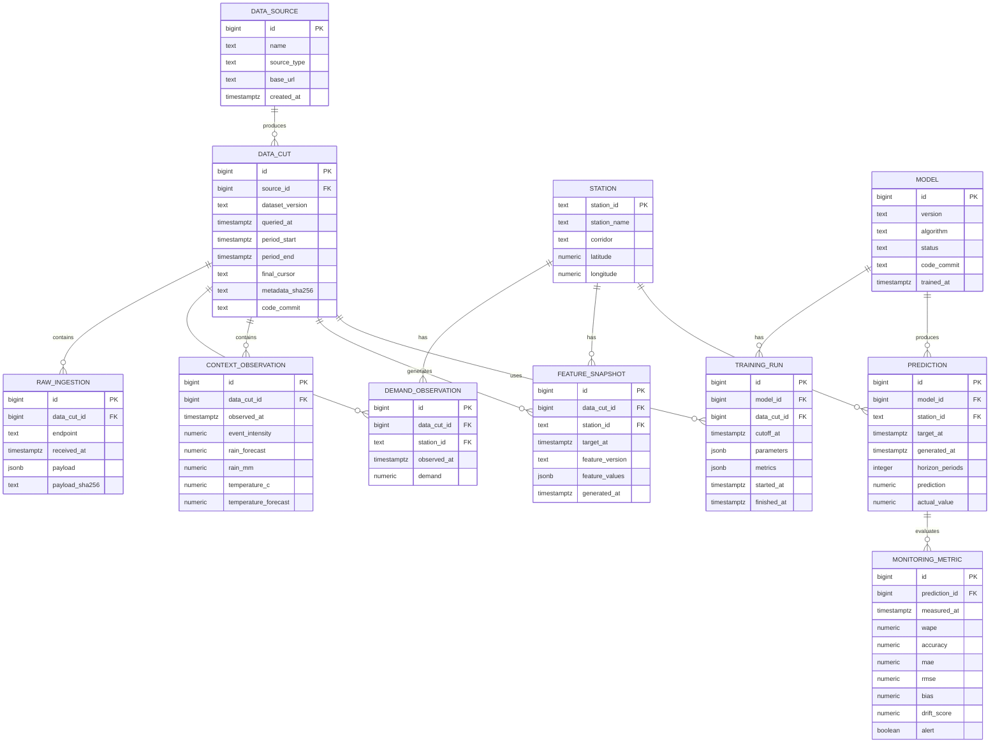

# Modelo de datos propuesto

Este esquema adapta el modelo del proyecto a los datos realmente disponibles en la API de Pulso TransMi. Es una propuesta de persistencia para PostgreSQL o Supabase; no crea tablas ni ejecuta migraciones.

## Alcance

El modelo cubre:

- catalogo georreferenciado de estaciones;
- observaciones de demanda;
- variables de contexto;
- cortes reproducibles de ingesta;
- features versionadas;
- modelos y ejecuciones de entrenamiento;
- predicciones por estacion y horizonte;
- metricas de monitoreo y drift;
- trazabilidad de la fuente y de los payloads recibidos.

No incluye `ruta`, `servicio` ni eventos operativos detallados porque esas entidades no existen en la API actual.

## Diagrama



## DDL PostgreSQL

```sql
create table data_source (
    id bigint generated always as identity primary key,
    name text not null,
    source_type text not null,
    base_url text not null,
    created_at timestamptz not null default now()
);

create table data_cut (
    id bigint generated always as identity primary key,
    source_id bigint not null references data_source(id),
    dataset_version text not null,
    queried_at timestamptz not null default now(),
    period_start timestamptz not null,
    period_end timestamptz not null,
    final_cursor text,
    metadata_sha256 text,
    code_commit text,
    check (period_end >= period_start),
    unique (source_id, dataset_version, period_start, period_end)
);

create table station (
    station_id text primary key,
    station_name text not null,
    corridor text not null,
    latitude numeric(9, 6) not null,
    longitude numeric(9, 6) not null,
    check (latitude between -90 and 90),
    check (longitude between -180 and 180)
);

create table demand_observation (
    id bigint generated always as identity primary key,
    data_cut_id bigint not null references data_cut(id),
    station_id text not null references station(station_id),
    observed_at timestamptz not null,
    demand numeric not null,
    check (demand >= 0),
    unique (data_cut_id, station_id, observed_at)
);

create index demand_observation_time_idx
    on demand_observation (station_id, observed_at);

create table context_observation (
    id bigint generated always as identity primary key,
    data_cut_id bigint not null references data_cut(id),
    observed_at timestamptz not null,
    event_intensity numeric not null,
    rain_forecast numeric not null,
    rain_mm numeric not null,
    temperature_c numeric not null,
    temperature_forecast numeric not null,
    check (event_intensity between 0 and 1),
    check (rain_forecast >= 0),
    check (rain_mm >= 0),
    unique (data_cut_id, observed_at)
);

create index context_observation_time_idx
    on context_observation (observed_at);

create table raw_ingestion (
    id bigint generated always as identity primary key,
    data_cut_id bigint not null references data_cut(id),
    endpoint text not null,
    received_at timestamptz not null default now(),
    payload jsonb not null,
    payload_sha256 text not null
);

create index raw_ingestion_cut_endpoint_idx
    on raw_ingestion (data_cut_id, endpoint);

create table feature_snapshot (
    id bigint generated always as identity primary key,
    data_cut_id bigint not null references data_cut(id),
    station_id text not null references station(station_id),
    target_at timestamptz not null,
    feature_version text not null,
    feature_values jsonb not null,
    generated_at timestamptz not null default now(),
    unique (data_cut_id, station_id, target_at, feature_version)
);

create table model (
    id bigint generated always as identity primary key,
    version text not null unique,
    algorithm text not null,
    status text not null,
    code_commit text,
    trained_at timestamptz not null,
    check (status in ('candidate', 'active', 'retired', 'failed'))
);

create table training_run (
    id bigint generated always as identity primary key,
    model_id bigint not null references model(id),
    data_cut_id bigint not null references data_cut(id),
    cutoff_at timestamptz not null,
    parameters jsonb not null default '{}'::jsonb,
    metrics jsonb not null default '{}'::jsonb,
    started_at timestamptz not null,
    finished_at timestamptz,
    check (finished_at is null or finished_at >= started_at)
);

create table prediction (
    id bigint generated always as identity primary key,
    model_id bigint not null references model(id),
    station_id text not null references station(station_id),
    target_at timestamptz not null,
    generated_at timestamptz not null,
    horizon_periods integer not null,
    prediction numeric not null,
    actual_value numeric,
    check (horizon_periods > 0),
    check (prediction >= 0),
    unique (model_id, station_id, target_at, horizon_periods)
);

create index prediction_station_time_idx
    on prediction (station_id, target_at);

create table monitoring_metric (
    id bigint generated always as identity primary key,
    prediction_id bigint not null references prediction(id),
    measured_at timestamptz not null default now(),
    wape numeric,
    accuracy numeric,
    mae numeric,
    rmse numeric,
    bias numeric,
    drift_score numeric,
    alert boolean not null default false,
    check (wape is null or wape >= 0),
    check (mae is null or mae >= 0),
    check (rmse is null or rmse >= 0)
);
```

## Mapeo con la API actual

| Tabla | Fuente actual | Campos |
|---|---|---|
| `station` | `GET /v1/stations` | `station_id`, `station_name`, `corridor`, `latitude`, `longitude` |
| `demand_observation` | `GET /v1/observations` | `station_id`, `observed_at`, `demand` |
| `context_observation` | `GET /v1/context` | `observed_at`, variables de clima y eventos |
| `data_cut` | `GET /v1/meta` + ejecución de ingesta | versión, rango, hashes, cursor y commit |
| `raw_ingestion` | respuestas paginadas de la API | payload original y hash |
| `feature_snapshot` | pipeline futuro | lags, calendario, rolling features y contexto disponible |
| `model` | entrenamiento futuro | versión, algoritmo y estado |
| `training_run` | pipeline futuro | cutoff, parámetros y métricas |
| `prediction` | inferencia futura | estación, horizonte, predicción y valor real |
| `monitoring_metric` | monitoreo futuro | WAPE, Accuracy, MAE, RMSE, bias y drift |

## Decisiones importantes

1. `station_id` se conserva como `text` para proteger ceros iniciales como `07107`.
2. Todos los timestamps se almacenan como `timestamptz`.
3. `demand` es la variable objetivo continua; no se modela como clase.
4. `event_intensity` permanece como contexto hasta que exista una fuente de eventos individuales.
5. `precision` y `recall` no se incluyen porque el problema actual es de regresión.
6. Cada entrenamiento apunta a un `data_cut` y a un `cutoff_at` para evitar leakage temporal.
7. `actual_value` puede ser `NULL` hasta que la observación real esté disponible.
8. Los valores `demand = 999` deben marcarse o revisarse en la ingesta antes de decidir su tratamiento.
9. `feature_values` es `jsonb` para permitir evolución inicial; cuando las features se estabilicen, las más consultadas pueden normalizarse en columnas.
10. La restricción única de predicción permite repetir una ejecución sin duplicar la misma predicción lógica.

## Orden recomendado de implementación

1. `data_source`, `data_cut` y `station`.
2. `demand_observation` y `context_observation`.
3. `raw_ingestion` si se necesita auditoría de payloads.
4. `feature_snapshot` con versionado explícito.
5. `model` y `training_run`.
6. `prediction`.
7. `monitoring_metric`.

Este modelo refleja el repositorio actual sin inventar rutas, servicios o eventos operativos que la API todavía no proporciona.
